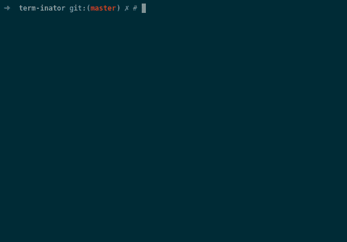

# sh-presenter
Tool for creating shell presentations

## API ##
Presenter class provides following methods:

* `__init__(self, width, height, cps, interactive)`: 
* `sleep(self, duration) -> None`:
* `type(self, *args, speed) -> None`:
* `vim_diff(self) -> str`:
* `marker(self, marker_id) -> None`:
* `save(self, path, start, end) -> None`:
* `recorder(self, path)`:

## Usage ##
We create presentation as python script using `Presenter` API, samples can be found in `examples` directory.

### examples/cacafire.py ###
```python3
from sh_presenter import Presenter, Keys


if __name__ == '__main__':
    with Presenter(80, 25, interactive=False) as p:
        p.cps = 16  # 16 chars per second

        # initialize terminal
        p.type('unset HISTFILE', Keys.ENTER, speed=p.INSTANT)
        p.type('reset', Keys.ENTER, speed=p.INSTANT)
        p.sleep(5000)
        
        # set marker
        p.marker('after_init')

        # display comments
        p.type('# Hello, My name is Paweł', Keys.ENTER)
        p.type('# I will demonstrate you cacafire', Keys.ENTER)
        p.sleep(1000)

        # type command
        p.type('DISPLAY= cacafire ', speed=0.5)
        p.sleep(2000)

        # start the show
        with p.recorder('only_fire.cast'):
            p.type(Keys.ENTER)

            p.sleep(3000)
            p.type(Keys.ESC)

        # show "whole" animation (without initialization)
        p.save('cacafire.cast', start='after_init')
```

After executing script two asciicast files are generated, `cacafire.cast` and `only_fire.cast`.
They can be published to asciinema.org or rendered to gif using `asciicast2gif` project.

### Upload to asciinema.org ###
```bash
asciinema upload cacafire.cast
```

### Rendering to GIF ###
```bash
docker run --rm -v $PWD:/data asciinema/asciicast2gif -S1 -t solarized-dark cacafire.cast cacafire.gif
```


